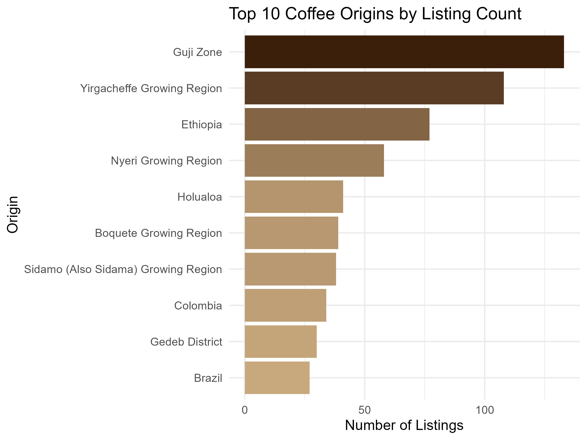
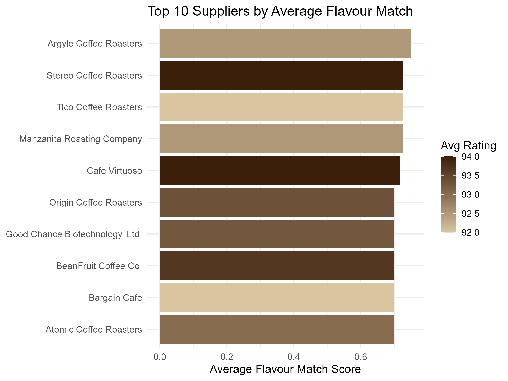
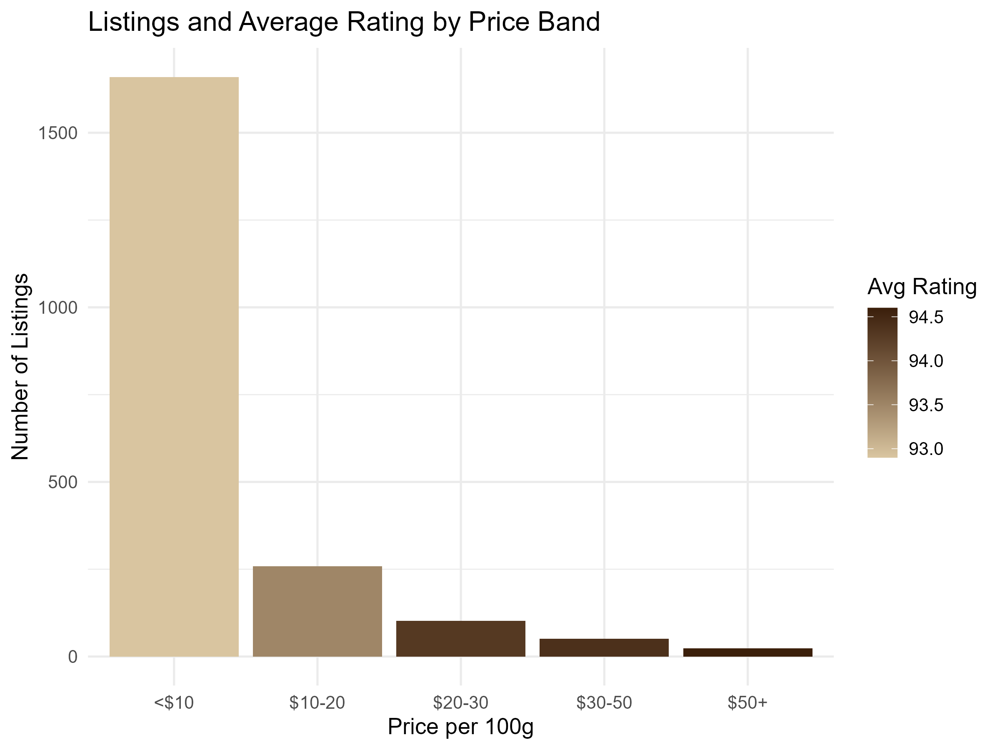
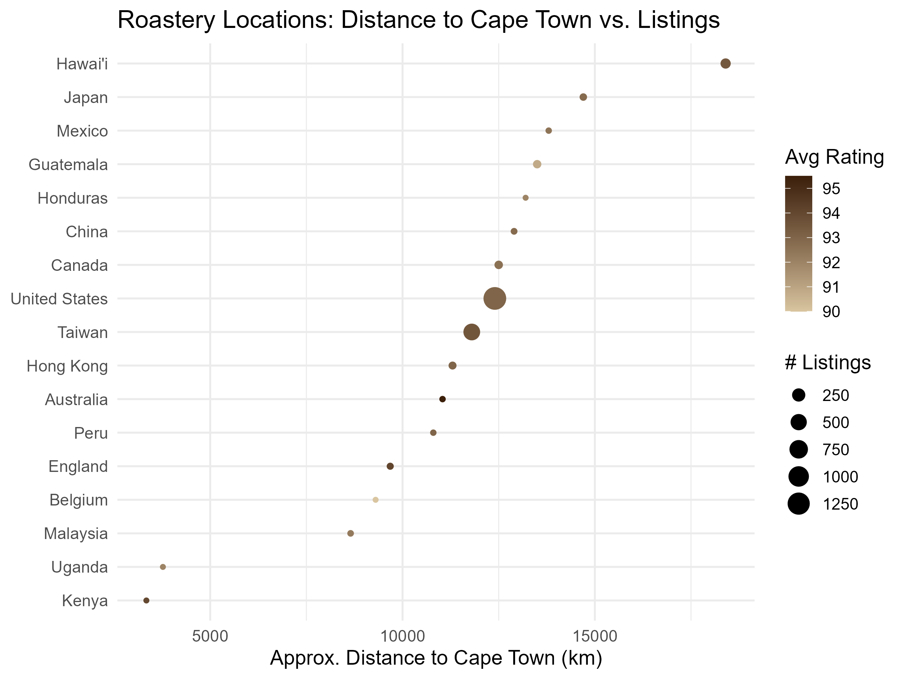

## Context

- A coffee entrepreneur wants to stock a **premium coffee shop at the Neelsie**, Stellenbosch University.
- Goal is not just "highest rated coffee" — it's the coffee that maximises **customer satisfaction and business profitability**.
- Decision inputs: a database of roasters, expert reviews, ratings, origin, roast strength, price (USD) and roastery location; plus a Stellenbosch student survey of preferred flavour words.
- This analysis combines **flavour match, expert rating, price and shipping distance** into one ranked business-viability score.

## Data Overview

|Metric                    |Value           |
|:-------------------------|:---------------|
|Total listings            |2,095           |
|Unique roasters           |422             |
|Unique roastery locations |17              |
|Rating range              |84-98           |
|Price range (USD/100g)    |$0.12 - $132.28 |

## Rating by Roast Strength

<!-- -->

> **Key insight:** Medium and Light roasts tend to score highest — ideal for a specialty café menu.

## Top Coffee Origins

<!-- -->

> **Key insight:** Ethiopian growing regions (Guji, Yirgacheffe) and Kenyan regions dominate listings — both well-regarded specialty origins.

---

## Q2: Which Coffees Best Match Stellenbosch Flavour Preferences?

Reviews were searched for the student survey's preferred flavour words (sweet,
chocolate, aroma, mouthfeel, finish, structure, cup, toned, sweetly, savory, notes,
acidity, syrupy, deeply, zest, richly, tart, fruit, crisp, short).

<!-- -->

Table: Flavour-Word Frequency in Expert Reviews

|keyword   | matches| avg_rating|
|:---------|-------:|----------:|
|cup       |    2085|       93.1|
|aroma     |    2078|       93.1|
|finish    |    2069|       93.1|
|mouthfeel |    2040|       93.1|
|sweet     |    2023|       93.1|
|fruit     |    1707|       93.2|
|toned     |    1690|       93.1|
|structure |    1657|       93.1|
|acidity   |    1612|       93.2|
|notes     |    1429|       93.1|
|crisp     |    1016|       92.8|
|chocolate |    1010|       93.0|
|richly    |     989|       93.3|
|tart      |     906|       93.5|
|sweetly   |     780|       93.1|
|syrupy    |     763|       93.7|
|deeply    |     561|       93.4|
|zest      |     561|       93.2|
|savory    |     509|       93.4|
|short     |     227|       93.0|

> **Key insight:** "Sweet", "chocolate" and "notes" are the most common matched words, and coffees matching more student-preferred words also tend to carry strong expert ratings.

## Q3: Which Suppliers Provide the Best Flavour-Matching Coffees?

<!-- -->

Table: Top 10 Suppliers by Average Flavour Match (min. 2 listings)

|roaster                         |loc_country   | n_coffees| avg_flavour| avg_rating| avg_price|
|:-------------------------------|:-------------|---------:|-----------:|----------:|---------:|
|Argyle Coffee Roasters          |United States |         2|        0.75|      92.50|      5.29|
|Stereo Coffee Roasters          |Canada        |         2|        0.73|      94.00|      5.27|
|Manzanita Roasting Company      |United States |         2|        0.72|      92.50|      5.14|
|Tico Coffee Roasters            |United States |         2|        0.72|      92.00|      5.88|
|Cafe Virtuoso                   |United States |         3|        0.72|      94.00|      9.60|
|BeanFruit Coffee Co.            |United States |         3|        0.70|      93.67|      4.80|
|Origin Coffee Roasters          |Hawai'i       |         6|        0.70|      93.33|     11.96|
|Good Chance Biotechnology, Ltd. |Taiwan        |         4|        0.70|      93.25|     90.83|
|Atomic Coffee Roasters          |United States |         2|        0.70|      93.00|      5.29|
|Bargain Cafe                    |Taiwan        |         3|        0.70|      92.00|      5.95|

## Q4: What Does the Top Flavour-Matching Coffee Cost?

Table: Average Cost per 100g: All Coffees vs. Top Flavour Matches

|Group                  | avg_price| median_price| min_price| max_price|    n|
|:----------------------|---------:|------------:|---------:|---------:|----:|
|All Coffees            |      9.32|         5.86|      0.12|    132.28| 2095|
|Top 20 Flavour Matches |      5.85|         5.14|      3.54|     19.84|   20|

<!-- -->

> **Key insight:** The top flavour-matching coffees are not the most expensive — strong matches exist well within an affordable price band.

## Q6: Which Coffee-Producing Regions/Roastery Locations Should Be Prioritised?

<!-- -->

Table: Roastery Locations Ranked by Distance to Cape Town

|loc_country   |    n| avg_rating| avg_price| distance_km|
|:-------------|----:|----------:|---------:|-----------:|
|Kenya         |    1|       94.0|       6.9|        3340|
|Uganda        |    1|       92.0|       4.0|        3770|
|Malaysia      |    3|       92.3|       8.1|        8650|
|Belgium       |    1|       90.0|       3.0|        9300|
|England       |    7|       94.1|      92.2|        9680|
|Peru          |    2|       93.0|       4.0|       10800|
|Australia     |    2|       95.5|      42.8|       11040|
|Hong Kong     |   20|       93.0|      13.3|       11300|
|Taiwan        |  555|       93.5|       9.2|       11800|
|United States | 1337|       93.0|       8.5|       12400|
|Canada        |   31|       92.6|       5.5|       12500|
|China         |    4|       92.8|      26.2|       12900|
|Honduras      |    1|       92.0|      11.5|       13200|
|Guatemala     |   29|       90.8|       3.6|       13500|
|Mexico        |    2|       92.5|      10.6|       13800|
|Japan         |   12|       92.8|      13.2|       14700|
|Hawai'i       |   87|       93.4|      17.6|       18400|

> **Key insight:** The United States and Taiwan combine high listing volume with reasonable rating levels; Kenya and Uganda offer the shortest shipping distance to South Africa among origin-adjacent roasters.

## Q5 & Q7: Business Viability Score — Combining Flavour, Rating, Price & Logistics

Each coffee is scored on flavour match (35%), expert rating (30%), price (20%, cheaper
is better) and shipping distance to Cape Town (15%, closer is better), each normalised
to a 0-1 scale.

<!-- -->

## Final Recommendation: Top 10 Coffees & Suppliers for the Neelsie

Table: Ranked Recommendation: Optimal Coffees & Suppliers

| Rank|Coffee                                   |Roaster                   |Roastery Location |Flavour Match | Rating|Price/100g | Distance (km)| Viability Score|
|----:|:----------------------------------------|:-------------------------|:-----------------|:-------------|------:|:----------|-------------:|---------------:|
|    1|Kenya Ruthaka Peaberry                   |Temple Coffee Roasters    |United States     |93%           |     95|$5.58      |         12400|            0.81|
|    2|Ulos Batak Sumatra                       |JBC Coffee Roasters       |United States     |86%           |     96|$5.57      |         12400|            0.81|
|    3|Mandheling Onan Ganjang                  |Kakalove Cafe             |Taiwan            |93%           |     94|$3.89      |         11800|            0.80|
|    4|Sustainable Harvest Homacho Waeno Nat... |Red E Café                |United States     |100%          |     93|$4.70      |         12400|            0.80|
|    5|Ethiopia Natural Guji Dasaya SP          |Kakalove Cafe             |Taiwan            |86%           |     95|$4.96      |         11800|            0.79|
|    6|Yirgacheffe Gedeb G1 Natural             |MJ Bear Coffee            |Taiwan            |86%           |     94|$4.96      |         11800|            0.77|
|    7|Ethiopia Natural Guji Uraga G1 Lot 20-05 |Kakalove Cafe             |Taiwan            |86%           |     94|$5.31      |         11800|            0.77|
|    8|Kivu DR Congo                            |JBC Coffee Roasters       |United States     |86%           |     94|$4.97      |         12400|            0.77|
|    9|Shakiso Natural                          |JBC Coffee Roasters       |United States     |86%           |     94|$5.58      |         12400|            0.77|
|   10|Ethiopian Yirgacheffe Natural            |Dragonfly Coffee Roasters |United States     |86%           |     94|$5.88      |         12400|            0.77|

## Recommendations Summary

**Flavour & Region:**

- Prioritise Ethiopian (Guji, Yirgacheffe) and Kenyan growing regions — strongest flavour-word matches and ratings.

**Roast:**

- Focus on **Light** and **Medium** roasts for highest expert ratings.

**Suppliers:**

- Contact the top-ranked suppliers in the recommendation table first — they combine strong flavour match, high rating, and reasonable price.

**Logistics:**

- Where flavour/rating/price are comparable, prefer roastery locations closer to South Africa (e.g. Kenya, Uganda) to reduce shipping cost and lead time; the US and Taiwan remain worth sourcing from given their volume and quality despite longer distance.

**Bottom line:** The ranked recommendation table balances customer satisfaction (flavour
match + rating) against business feasibility (price + logistics) — giving the
entrepreneur a short, actionable supplier shortlist rather than a purely descriptive
ratings list.
