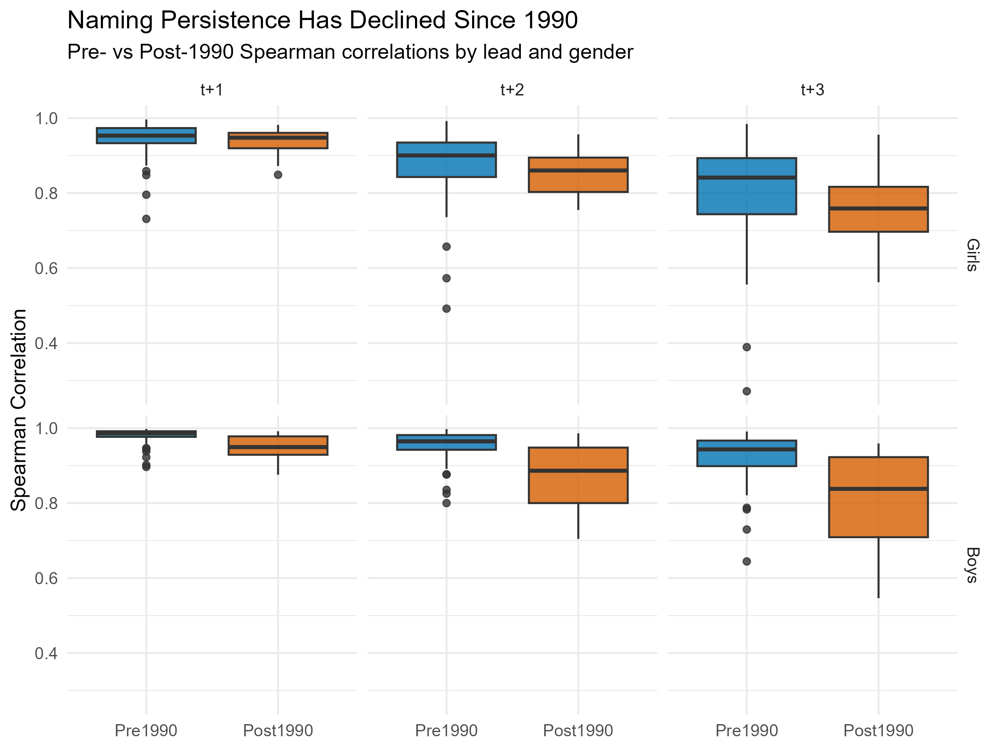
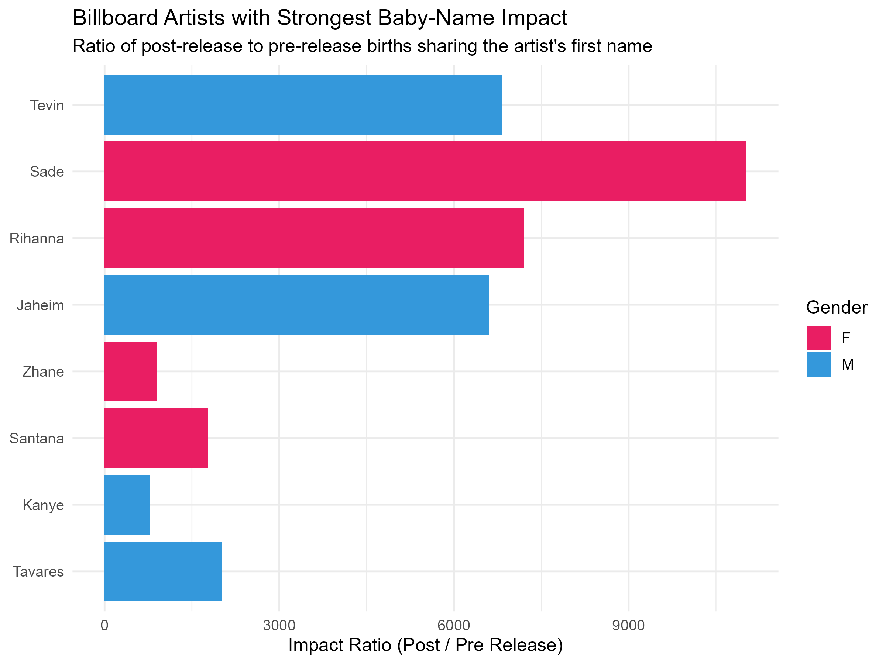

```{r setup, include=FALSE}
knitr::opts_chunk$set(
  echo    = FALSE,
  message = FALSE,
  warning = FALSE,
  fig.width  = 9,
  fig.height = 5
)

if (!require("pacman")) install.packages("pacman")
pacman::p_load(knitr, readr)

source("code/run_project.R")
```

# 1. Introduction

A New York-based toy design agency wants to understand baby naming trends in the United
States between 1910 and 2014, to guide character-naming decisions for new toy lines. This
report addresses five questions:

- How **persistent** are naming trends through time?
- Have naming trends become **shorter-lived since the 1990s**, as the agency suspects?
- Which names experienced the biggest **year-on-year spikes**?
- Does **popular music or musicians** (Billboard charts) or **television** (HBO titles) measurably
  influence naming decisions?
- Which names were **fads** (one-hit wonders) versus long-lasting choices?

The analysis follows a functional-programming pipeline: every transformation is a small,
pure function that takes data in and returns data out, composed via `dplyr`/`purrr`
pipelines rather than `for`/`while` loops, and orchestrated by a single master script
(`code/run_project.R`).

---

# 2. Data

Four datasets are used, loaded via `code/data/load_data.R` and cleaned via
`code/data/clean_data.R`:

```{r data-overview}
tibble::tibble(
  Dataset       = c("Baby_Names_By_US_State.rds", "charts.rds", "HBO_titles.rds", "HBO_credits.rds"),
  Description   = c(
    "Annual US birth counts by name, gender and state (1910-2014)",
    "Weekly Billboard Hot 100 chart positions (song, artist, date)",
    "HBO catalogue titles with release year",
    "HBO cast/crew credits, including character names"
  ),
  Rows = c(
    format(nrow(raw_data$baby_names), big.mark = ","),
    format(nrow(raw_data$billboard), big.mark = ","),
    format(nrow(raw_data$hbo_titles), big.mark = ","),
    format(nrow(raw_data$hbo_credits), big.mark = ",")
  )
) %>% knitr::kable(caption = "Source datasets")
```

Baby name counts are aggregated to (year, gender, name) totals across all states before
they are matched against Billboard or HBO records, avoiding state-level duplication when
joining against the much smaller cultural datasets.

---

# 3. Naming Persistence

`code/analysis/naming_persistence.R` ranks the **Top 25** names per year and gender, then
computes the **Spearman rank correlation** between a base year *t* and years *t+1*, *t+2*
and *t+3*. A correlation near 1 means the same names dominate; a value near 0 means rapid
turnover.

```{r persistence-trend, fig.cap="Spearman rank correlation between Top-25 names in year t and year t+lead, 1910-2014"}
knitr::include_graphics("Question2_files/figures/persistence_trend.png")
```

- Boys' names are consistently **more persistent** than girls' names at every lead.
- Persistence declines as the lead grows from t+1 to t+3, as expected.
- A sharp dip in girls' persistence is visible around the 1960s, alongside a steady
  decline from the 1990s onward.

---

# 4. Era Comparison: Has Persistence Declined Since 1990?

`code/analysis/era_comparison.R` splits the persistence panel into **Pre-1990** and
**Post-1990** eras and compares their distributions.

```{r era-comparison, fig.cap="Pre- vs Post-1990 Spearman correlations by lead and gender"}

```

```{r era-summary-table}
read_csv("Question2_files/tables/era_summary.csv", show_col_types = FALSE) %>%
  dplyr::mutate(dplyr::across(dplyr::where(is.numeric), ~round(.x, 3))) %>%
  knitr::kable(caption = "Mean / median / SD Spearman correlation by era, lead and gender")
```

**Confirmed:** for every gender/lead combination, median correlation is lower Post-1990
than Pre-1990 — most pronounced at the 3-year lead, where boys' median correlation falls
from `r round(era_summary$median_correlation[era_summary$gender=="M" & era_summary$lead==3 & era_summary$era=="Pre1990"], 2)`
(Pre-1990) to `r round(era_summary$median_correlation[era_summary$gender=="M" & era_summary$lead==3 & era_summary$era=="Post1990"], 2)`
(Post-1990). This supports the agency's suspicion that naming trends have become
shorter-lived in recent decades.

---

# 5. Year-on-Year Name Spikes

`code/analysis/popularity_spikes.R` identifies the 50 biggest year-on-year jumps in birth
counts for any name.

```{r name-spikes, fig.cap="Top 50 year-on-year name spikes by absolute birth-count increase"}
knitr::include_graphics("Question2_files/figures/name_spikes_bubble.png")
```

```{r spikes-table}
read_csv("Question2_files/tables/name_spikes.csv", show_col_types = FALSE) %>%
  dplyr::slice_head(n = 10) %>%
  dplyr::select(year, name, gender, count, count_change, growth_rate) %>%
  dplyr::mutate(growth_rate = paste0(round(growth_rate, 1), "%")) %>%
  knitr::kable(caption = "Top 10 year-on-year name spikes")
```

The single largest spike is **Linda**, which surged **89%** in 1947 — the year after Jack
Lawrence's hit song "Linda" (1946) — a textbook example of a music-driven naming spike.
The 1940s dominate this list, reflecting the post-war baby boom amplifying any name already
gaining momentum.

---

# 6. Billboard Music Influence

`code/analysis/billboard_influence.R` matches Billboard chart artists' first names to baby
names, comparing births in the 5 years **after** a song charted to the 5 years **before**.

```{r billboard-effects, fig.cap="Billboard artists with the strongest baby-name impact ratio"}

```

```{r billboard-table}
read_csv("Question2_files/tables/billboard_matches.csv", show_col_types = FALSE) %>%
  dplyr::slice_max(impact_ratio, n = 10) %>%
  dplyr::select(first_name, gender, song, release_year, pre_release, post_release, impact_ratio) %>%
  dplyr::mutate(impact_ratio = round(impact_ratio, 1)) %>%
  knitr::kable(caption = "Top 10 Billboard-driven name impacts")
```

Distinctive artist first names (e.g. **Sade**, **Rihanna**, **Jaheim**) show the strongest
effect, since they had little baseline usage as baby names before the artist charted —
any post-release uptake produces a large impact ratio.

---

# 7. HBO Television Influence

`code/analysis/hbo_influence.R` applies the same pre/post-release logic to HBO character
first names extracted from cast credits.

```{r hbo-effects, fig.cap="HBO characters with the strongest baby-name impact ratio"}
knitr::include_graphics("Question2_files/figures/hbo_effects.png")
```

```{r hbo-table}
read_csv("Question2_files/tables/hbo_matches.csv", show_col_types = FALSE) %>%
  dplyr::slice_max(impact_ratio, n = 10) %>%
  dplyr::select(first_name, gender, title, release_year, pre_release, post_release, impact_ratio) %>%
  dplyr::mutate(impact_ratio = round(impact_ratio, 1)) %>%
  knitr::kable(caption = "Top 10 HBO-driven name impacts")
```

As with music, the strongest effects come from **uncommon character names** (e.g.
**Zaria**, **Whitley**, **Zander**) rather than already-popular names — confirming that
distinctive media names are the clearest signal of cultural influence on naming.

---

# 8. One-Hit Wonders

`code/analysis/one_hit_wonders.R` flags names that appear in the data for a single year
only — true naming fads.

```{r one-hit-wonders-table}
one_hit_wonders %>%
  dplyr::slice_max(peak_count, n = 10) %>%
  dplyr::select(name, gender, peak_year, peak_count, decade) %>%
  knitr::kable(caption = "Top 10 one-hit-wonder names by peak birth count")
```

`r format(nrow(one_hit_wonders), big.mark = ",")` names appear in only one year of the
dataset — the long tail of names tried briefly and never repeated, versus the durable
classics identified in Section 3.

---

# 9. Conclusions & Recommendations for the Toy Agency

- **Persistence is real but declining.** Boys' names remain more stable than girls' names,
  but both have become measurably less persistent since 1990 (Section 4) — favour
  flagship/legacy toy lines around durable names, and limited-edition lines around
  current trends.
- **Spikes are traceable to culture.** Billboard artists and HBO characters with
  distinctive first names produce the clearest, most attributable naming spikes
  (Sections 6-7) — monitoring chart and streaming data can help anticipate the next wave
  of trending names.
- **Fads are common but small.** Thousands of one-hit-wonder names exist, but they
  individually account for far fewer births than the sustained classics — useful for
  novelty product lines, not for core brand names.
- **Recommendation:** blend a small core of historically persistent names with a
  rotating set of culturally-driven names sourced from current music and television data.
