# 29418100 — Data Science Practical Examination

**Author:** Jennifer Mwenebanda<br> **Student number:** 29418100<br>
**Date:** 19 June 2026<br> **Lecturer:** NF Katzke 

------------------------------------------------------------------------

## Purpose and Structure

The purpose of this README is to explain my reasoning and process for
answering each question in the Data Science Practical Exam, and to
document the project’s folder structure so that any question can be
opened and reproduced independently.

The raw data supplied for the exam lives in the Exam Folder’s top-level
`Data/` directory. None of it is copied: a Windows directory junction
(`mklink /J`) links the project’s root `data/` folder to `../Data/`, and
each question’s own `data/<dataset>` subfolder is in turn junctioned to
the relevant dataset inside `Data/`. This means every question is a
fully self-contained RStudio project (its own `.Rproj`, `.Rmd`, `code/`,
`Tex/`, `Template/`) without a single byte of data being duplicated on
disk.

All data wrangling, analysis and plotting logic lives in small,
single-purpose functions inside each question’s own `code/as required for this exam. Each
question’s `.Rmd` sources its functions (directly, or via a master
script) and only ever calls them; raw computation never appears in the
report body itself. Output (PowerPoint slides, paged HTML reports, and
any persisted figures/tables backing them) is written into that
question’s own `Question#_files/` folder.

------------------------------------------------------------------------

## Getting Started

The exam project and its four question sub-projects were created as
follows (run once, from the Exam Folder), mirroring the structure of the
supplied `Mock_Solution` template with `STUDENTNUMBER` replaced by
`29418100`:

``` r
library(tidyverse)

student_number <- "29418100"
exam_dir    <- "C:/Users/JENNIFER/OneDrive - Stellenbosch University/MCom 2026/First Semester/Data Science/Exam Folder"
project_dir <- file.path(exam_dir, student_number)

dir.create(project_dir, showWarnings = FALSE)

# Root .Rproj
writeLines(
  c("Version: 1.0", "RestoreWorkspace: Default", "SaveWorkspace: Default",
    "AlwaysSaveHistory: Default", "EnableCodeIndexing: Yes", "UseSpacesForTab: Yes",
    "NumSpacesForTab: 2", "Encoding: UTF-8", "RnwWeave: Sweave", "LaTeX: pdfLaTeX",
    paste0("ProjectName: ", student_number)),
  file.path(project_dir, paste0(student_number, ".Rproj"))
)

# Junction the root data/ folder to the Exam Folder's Data/ (no copy)
shell(sprintf('mklink /J "%s" "%s"',
              file.path(project_dir, "data"), file.path(exam_dir, "Data")))

# Each Question# folder mirrors Mock_Solution/Mock_Solution (.Rproj, .Rmd, code/,
# Tex/, Template/, Question#_files/), with its own data/<dataset> folder junctioned
# to the matching subfolder of Data/ — e.g. for Question 2 (US Baby Names):
shell(sprintf('mklink /J "%s" "%s"',
              file.path(project_dir, "Question2", "data", "US_Baby_names"),
              file.path(exam_dir, "Data", "US_Baby_names")))
```

------------------------------------------------------------------------

## Folder Structure

    29418100/
    ├── 29418100.Rproj
    ├── README.Rmd          ← this file (root summary)
    ├── .gitignore          ← excludes data/ and output artefacts
    ├── data/               ← junction to ../Data/ (not committed)
    │
    ├── Question1/          ← Coffee Hub (PowerPoint output)
    │   ├── Question1.Rmd
    │   ├── code/
    │   │   ├── load_coffee.R      (CSV loader with encoding fallback)
    │   │   └── plot_coffee.R      (rating, origin, price-vs-rating, top-roasters)
    │   ├── data/Coffee/           (junction — not committed)
    │   └── Tex/
    │
    ├── Question2/          ← US Baby Naming Trends (paged HTML) — UPDATED, see below
    │   ├── Question2.Rmd
    │   ├── code/
    │   │   ├── run_project.R          (master orchestrator — sourced by Question2.Rmd)
    │   │   ├── utils/                 (packages.R, paths.R, helpers.R, save_outputs.R)
    │   │   ├── data/                  (load_data.R, clean_data.R)
    │   │   ├── analysis/              (naming_persistence.R, era_comparison.R,
    │   │   │                            popularity_spikes.R, billboard_influence.R,
    │   │   │                            hbo_influence.R, one_hit_wonders.R)
    │   │   └── visualisation/         (persistence_plots.R, spike_plots.R,
    │   │                                billboard_plots.R, hbo_plots.R)
    │   ├── data/US_Baby_names/        (junction — not committed)
    │   ├── Question2_files/
    │   │   ├── figures/               (5 PNGs — persisted plot outputs)
    │   │   └── tables/                (6 CSVs — persisted analysis outputs)
    │   ├── Template/ and Tex/
    │
    ├── Question3/          ← Loans & Credit (HTML paged output)
    │   ├── Question3.Rmd
    │   ├── code/
    │   │   ├── clean_loans.R      (status classification, rate parsing)
    │   │   └── plot_loans.R       (grade, home ownership, DTI, state maps)
    │   ├── data/Loan_Cred/        (junction — not committed)
    │   ├── Template/ and Tex/
    │
    └── Question4/          ← Netflix (HTML paged output)
        ├── Question4.Rmd
        ├── code/
        │   └── netflix_plots.R    (genre, runtime, score dist, text analysis)
        ├── data/netflix/          (junction — not committed)
        ├── Template/ and Tex/

> **Status note:** Questions 1, 3 and 4 currently use the original
> single-file-per-concern `code/` layout shown above. Question 2 has
> been migrated to the fully modular, functional-programming structure
> described below, wsince it had a lot of moving pieces to easily manage debuging; the other
> three questions will be updated to match in due course. This README
> will be expanded with their detailed approaches once that happens.

------------------------------------------------------------------------

## Question Summaries

------------------------------------------------------------------------

# Question 1 — Coffee Hub

A coffee entrepreneur stocking the Neelsie wants to know which coffees,
roasts and regions to source. Every coffee in the supplied database is
scored on flavour-keyword match against the Stellenbosch student survey
(35%), expert rating (30%), price (20%, cheaper is better) and shipping
distance to Cape Town (15%, closer is better), each normalised to 0-1,
to build one ranked business-viability score per coffee.

<div class="figure" style="text-align: center">

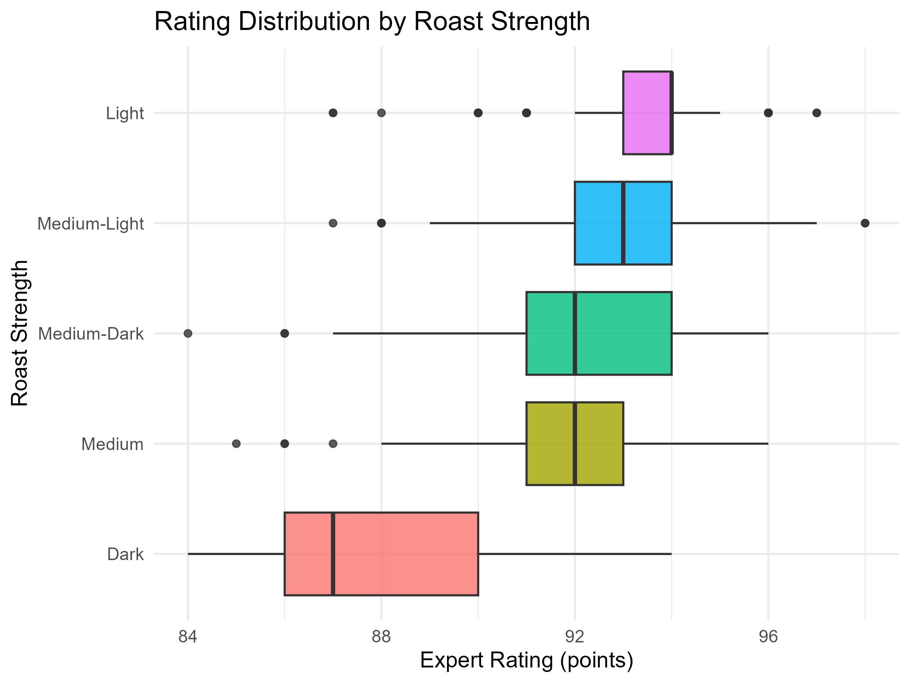
<p class="caption">

Average expert rating by roast strength
</p>

</div>

<div class="figure" style="text-align: center">

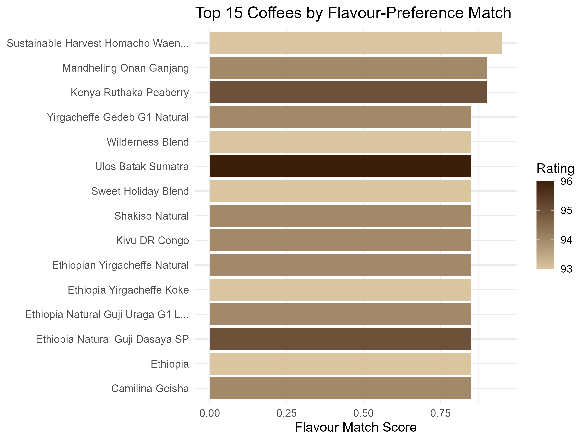
<p class="caption">

Coffees ranked by match against Stellenbosch students’ preferred flavour
words
</p>

</div>

<div class="figure" style="text-align: center">

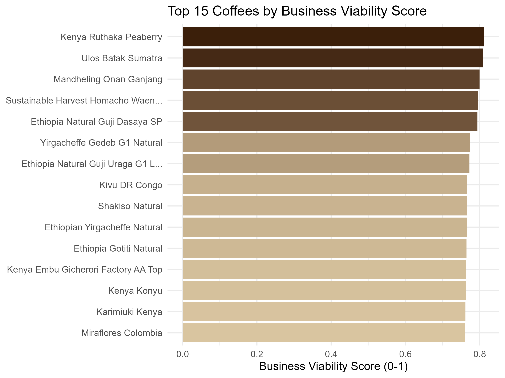
<p class="caption">

Coffees ranked by combined business-viability score
</p>

</div>

| Rank | Coffee | Roaster | Roastery Location | Flavour Match | Rating | Price/100g | Distance (km) | Viability Score |
|---:|:---|:---|:---|:---|---:|:---|---:|---:|
| 1 | Kenya Ruthaka Peaberry | Temple Coffee Roasters | United States | 93% | 95 | \$5.58 | 12400 | 0.81 |
| 2 | Ulos Batak Sumatra | JBC Coffee Roasters | United States | 86% | 96 | \$5.57 | 12400 | 0.81 |
| 3 | Mandheling Onan Ganjang | Kakalove Cafe | Taiwan | 93% | 94 | \$3.89 | 11800 | 0.80 |
| 4 | Sustainable Harvest Homacho Waeno Nat… | Red E Café | United States | 100% | 93 | \$4.70 | 12400 | 0.80 |
| 5 | Ethiopia Natural Guji Dasaya SP | Kakalove Cafe | Taiwan | 86% | 95 | \$4.96 | 11800 | 0.79 |

Top 5 recommended coffees by business-viability score

> **Recommendation:** Lead the shelf with light/medium-roast Kenyan and
> Ethiopian coffees — they combine the strongest flavour-keyword matches
> with high expert ratings at a fraction of the price of comparable
> Panama lots. Top pick: **Kenya Ruthaka Peaberry** (Temple Coffee
> Roasters, US) — 93% flavour match, rating 95, \$5.58/100g.

------------------------------------------------------------------------

# Question 2 — Baby Names

A New York toy design agency wants to know how persistent US baby-naming
trends are (1910-2014), and whether music or television measurably
drives naming spikes. Each year’s Top-25 boys’/girls’ names are
rank-correlated (Spearman) against the following 1-3 years, and the
sharpest year-on-year spikes are matched against Billboard chart and HBO
character data.

<div class="figure" style="text-align: center">

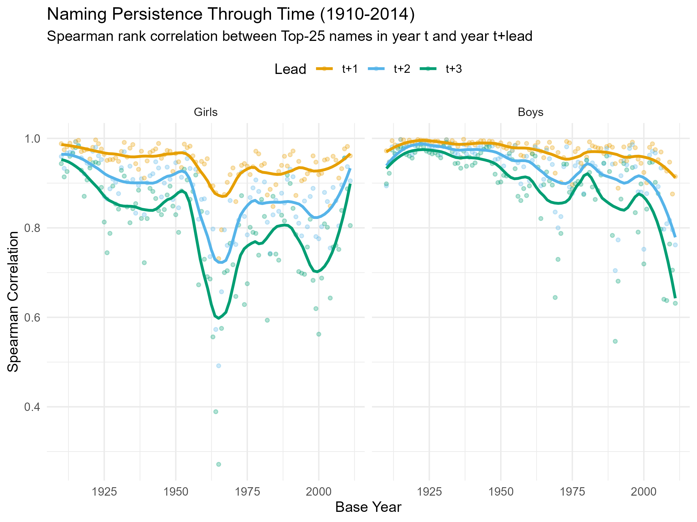
<p class="caption">

Spearman rank correlation between Top-25 names in year t and year
t+lead, 1910-2014
</p>

</div>

<div class="figure" style="text-align: center">

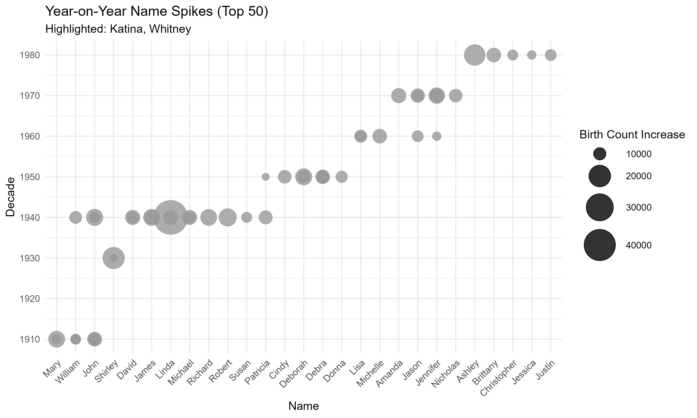
<p class="caption">

The biggest year-on-year name spikes, sized by peak births
</p>

</div>

<div class="figure" style="text-align: center">

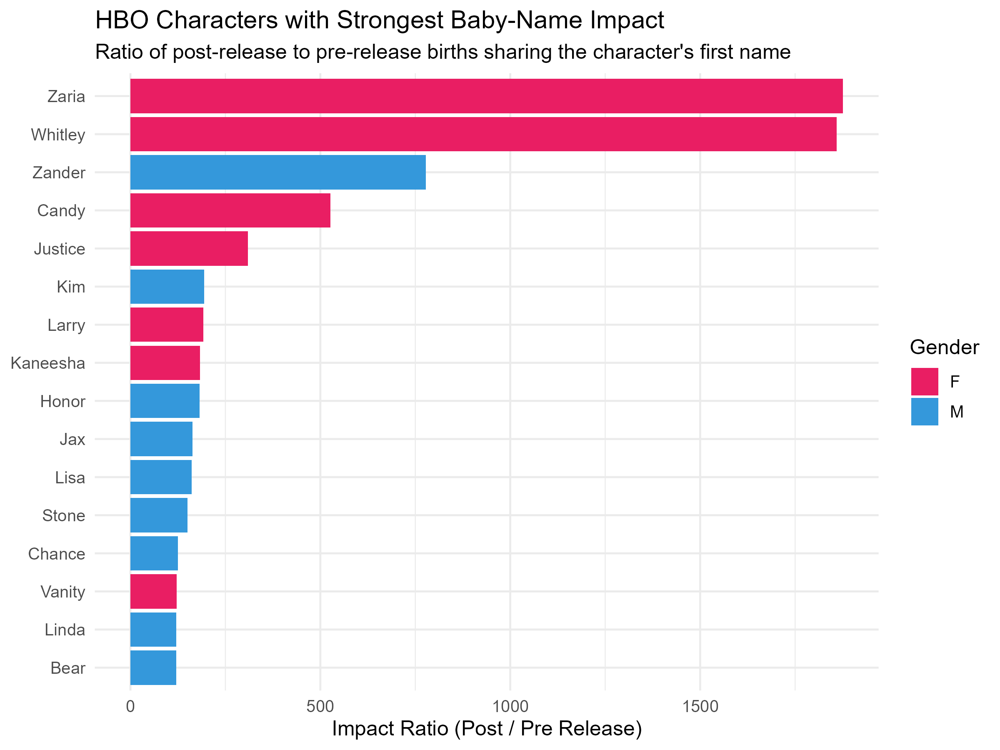
<p class="caption">

HBO characters with the strongest baby-name impact ratio
</p>

</div>

| Gender | Era      | Median correlation |
|:-------|:---------|-------------------:|
| F      | Pre1990  |              0.841 |
| F      | Post1990 |              0.759 |
| M      | Pre1990  |              0.943 |
| M      | Post1990 |              0.838 |

Median 3-year-lead rank correlation, pre- vs post-1990

> **Recommendation:** Naming trends are real but have become measurably
> less sticky since 1990 — boys’ 3-year-lead median correlation falls
> from 0.94 pre-1990 to 0.84 post-1990. Blend a stable core of
> long-persistent classic names for flagship toy lines with a rotating
> set of culturally-sourced names (pulled from current
> Billboard/streaming data) for limited-edition lines, and expect any
> single trending name today to fade faster than one would have a
> generation ago.

------------------------------------------------------------------------

# Question 3 — Loans and Credit

The US Credit Institute wants to know what actually drives default on
~383,000 resolved Lending Club loans (Fully Paid vs. Charged Off), and
whether its own long-held heuristics about home ownership, state
culture, credit grade and interest-rate drivers hold up.

<div class="figure" style="text-align: center">

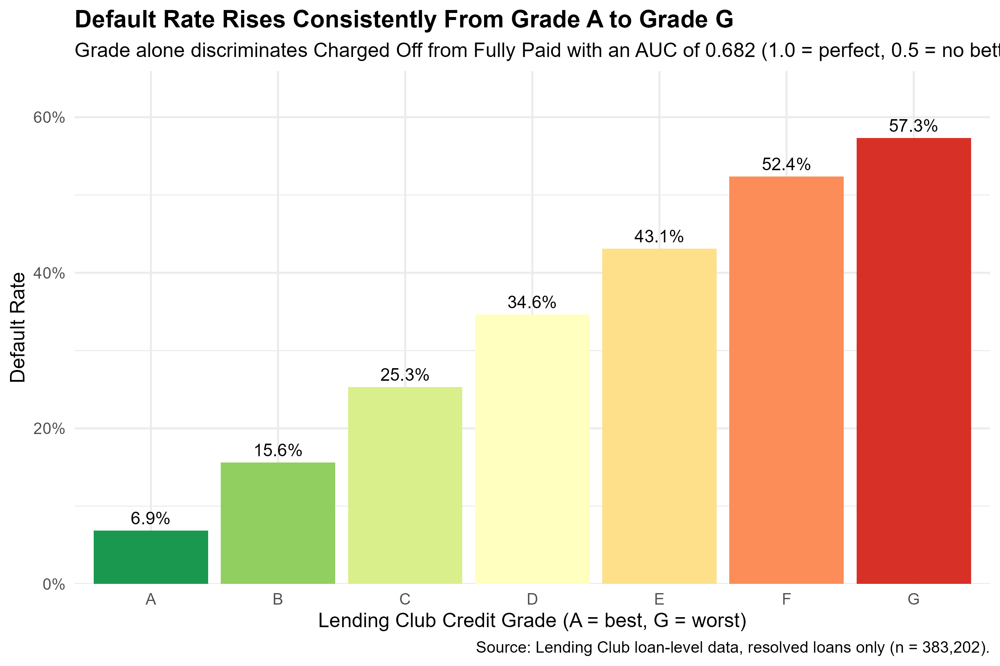
<p class="caption">

Default rate by Lending Club credit grade
</p>

</div>

<div class="figure" style="text-align: center">

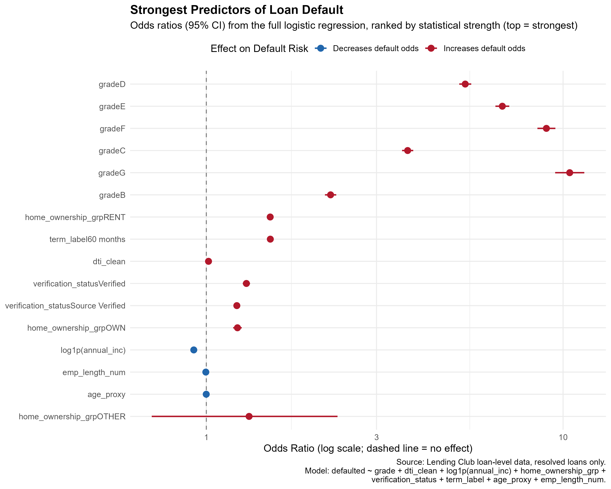
<p class="caption">

Multivariate default-model variable importance
</p>

</div>

<div class="figure" style="text-align: center">

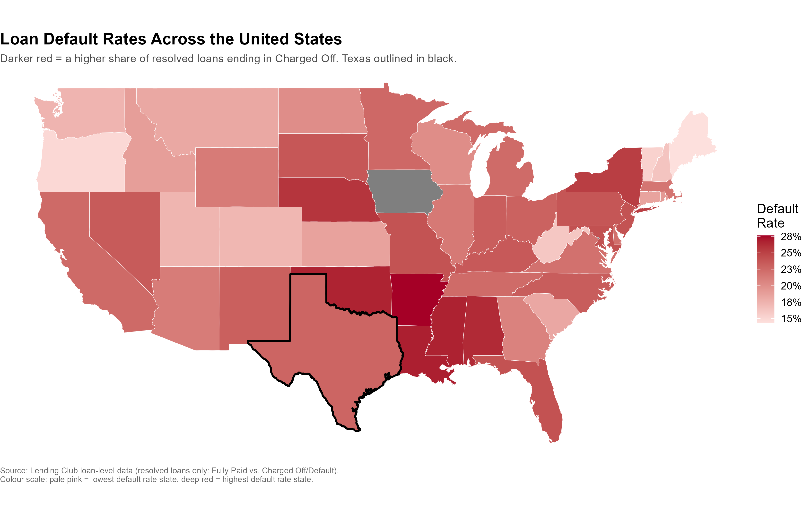
<p class="caption">

Default rate by US state, with Texas highlighted
</p>

</div>

| Grade | Loans   | Default rate |
|:------|:--------|:-------------|
| A     | 66,886  | 6.9%         |
| B     | 114,785 | 15.6%        |
| C     | 111,454 | 25.3%        |
| D     | 54,883  | 34.6%        |
| E     | 24,302  | 43.1%        |
| F     | 8,567   | 52.4%        |
| G     | 2,325   | 57.3%        |

Default rate by credit grade

> **Recommendation:** Anchor underwriting on credit grade first — it
> dominates every other variable’s odds ratio in the multivariate model,
> with default rising from 6.9% at Grade A to 57.3% at Grade G. Treat
> home ownership, employment length and state geography as secondary
> adjustments only. A DTI hard cap around 25-30% balances risk reduction
> against loan volume, and Texas needs no special treatment — its 22.8%
> default rate is statistically indistinguishable from the 22.5%
> national average.

------------------------------------------------------------------------

# Question 4 — Netflix

Ahead of launching a competing streaming service, the team wants to know
what works on Netflix’s catalogue (up to 2022/23): which genres and
countries dominate, how movies compare to TV shows on rating, and how
content length varies by country.

<div class="figure" style="text-align: center">

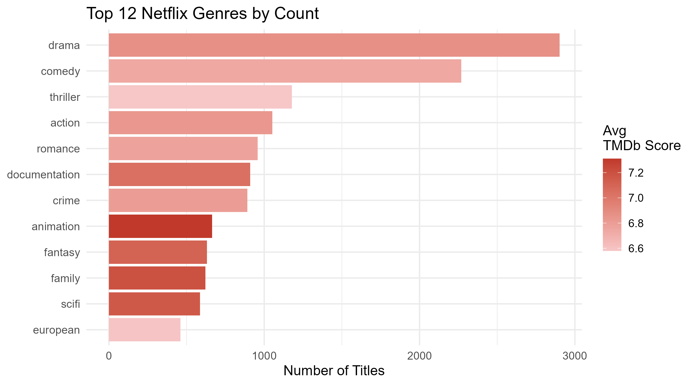
<p class="caption">

Top Netflix genres by title count, coloured by average TMDb score
</p>

</div>

<div class="figure" style="text-align: center">

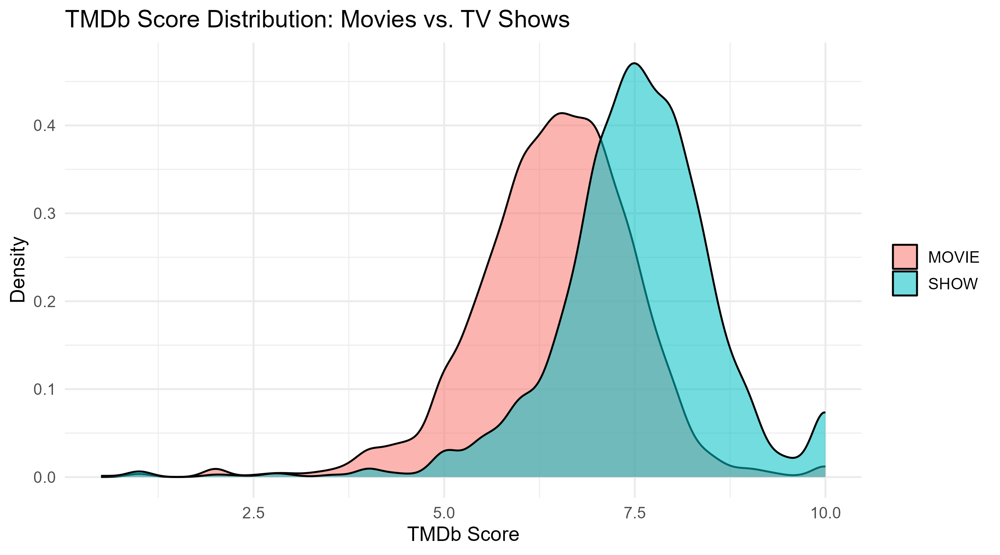
<p class="caption">

TMDb score distribution: movies vs. TV shows
</p>

</div>

<div class="figure" style="text-align: center">

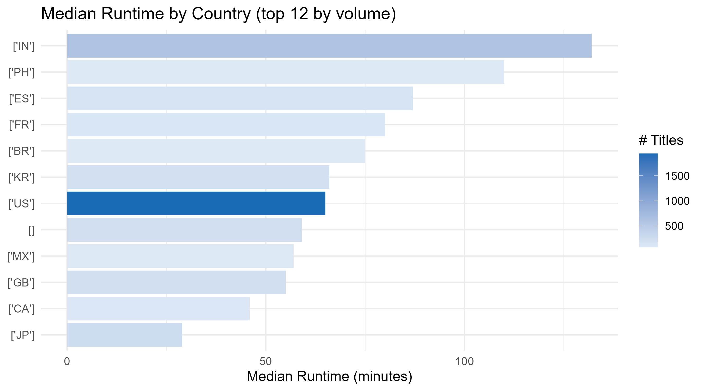
<p class="caption">

Median runtime by production country (top 12 by volume)
</p>

</div>

| Country | \# Titles |
|:--------|----------:|
| US      |      1950 |
| IN      |       605 |
| JP      |       266 |
| GB      |       219 |
| KR      |       210 |
| ES      |       159 |
| FR      |       124 |
| CA      |       103 |

Top 8 production countries by title count

> **Recommendation:** Invest in original TV dramas and documentaries
> over movies — shows average 7.5 vs. movies’ 6.45 on TMDb — and look
> beyond the US catalogue core. Indian films alone run more than double
> the typical US runtime (132 vs. 65 min median), signalling a genuinely
> different, underserved viewing culture worth co-producing for rather
> than copying outright.
